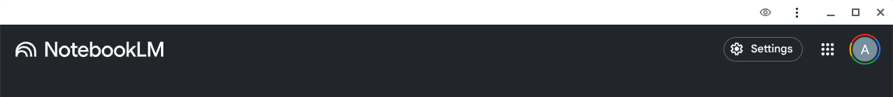
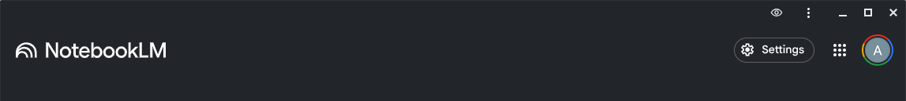

# PWA Task Bar Color Changer

## Motivation

As I experiment with ChromeOS and its web-based apps, I found that the OS color scheme have no effect on the title bar color of installed web apps, which is annoying and distracting. This small extension was made to address this issue.

For example, when installing NotebookLM as a PWA, the title bar defaults to white, which clashes with my dark theme:

With this extension, I can change the title bar color to match the theme:

## How It Works

1. **Open the extension popup** on any website that is installed on your machine as an app.
2. **Pick a color** using the color picker.
3. **Click "Save"** to apply the color to the site's title bar.
4. The color is stored and automatically applied every time you visit the site.
5. **Click "Remove"** to reset the site to its default theme color.

## License

MIT
